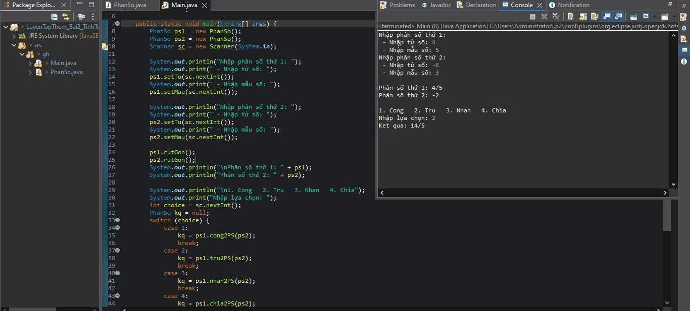
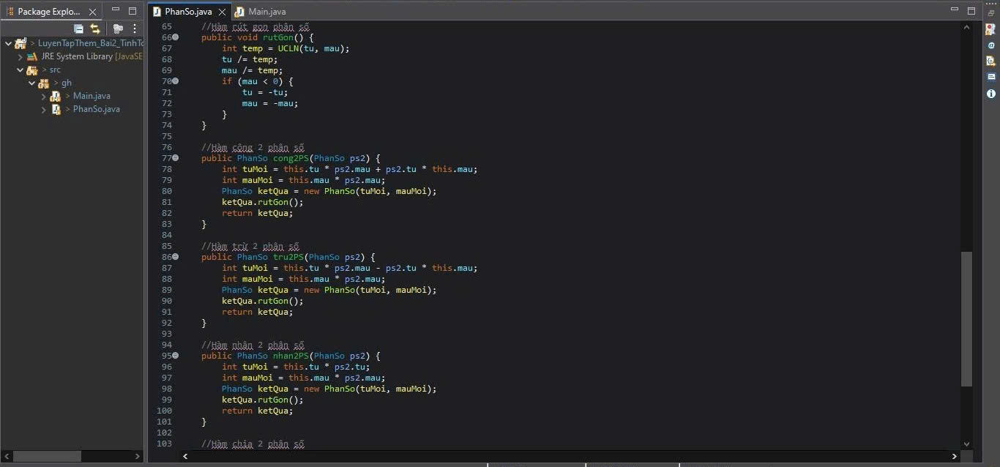

# JavaProgramming
## 📖 Giới thiệu
Kho lưu trữ này chứa toàn bộ các ví dụ và bài tập thực hành trong quá trình học tập Java, bao gồm các kiến thức từ nhập môn đến nâng cao hơn.

## 📚 Nội dung chính
1. Các khái niệm cơ bản của Java: biến, toán tử, các câu lệnh điều khiển, vòng lặp...
2. Làm quen với lập trình hướng đối tượng trên Java.
3. Tìm hiểu cách nhập/xuất dữ liệu trên Java.
4. Làm việc với stream và file.

## 🎯 Mục đích
1. Ghi lại quá trình học Java từ cơ bản đến nâng cao.
2. Theo dõi sự tiến bộ của bản thân qua từng giai đoạn học tập.
3. Thực hành và củng cố kiến thức lập trình Java.
4. Làm quen với cấu trúc tổ chức dự án và code.

## 🚀 Một số dự án tiêu biểu
### 1. Quản lý danh sách học sinh
[Xem chi tiết dự án](https://github.com/vohung06/66131266_JavaProgramming/tree/main/OOP_ViDu4_QLHSArrayList)

**Mô tả**: Dự án thực hiện chương trình quản lí danh sách học sinh bằng ArrayList các đối tượng thuộc lớp ```HocSinh```. Cho phép người dùng tạo danh sách học sinh, thêm học sinh mới và xoá học sinh.

**Lớp chính**: ```HocSinh```, ```Main```.

**Trọng tâm kiến thức**: OOP, ArrayList.

### 2. Tính toán phân số
[Xem chi tiết dự án](https://github.com/vohung06/66131266_JavaProgramming/tree/main/LuyenTapThem_Bai2_TinhToanPhanSo)

**Mô tả**: Xây dựng lớp ```PhanSo``` để biểu diễn phân số và xử lý các trường hợp đặc biệt. Cho phép người dùng nhập và thực hiện các thao tác tính toán cơ bản trên phân số.

**Lớp chính**: ```PhanSo```, ```Main```.

**Trọng tâm kiến thức**: OOP.



## 📝 Ghi chú: 
1. Mỗi bài tập là mỗi dự án riêng biệt, có thể chạy và thực thi độc lập.
2. Kho này phục vụ cho mục đích học tập, vì vậy code có thể chưa tối ưu hoặc dùng để áp dụng vào các dự án lớn.
